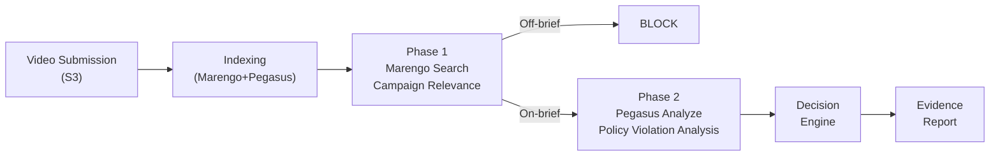
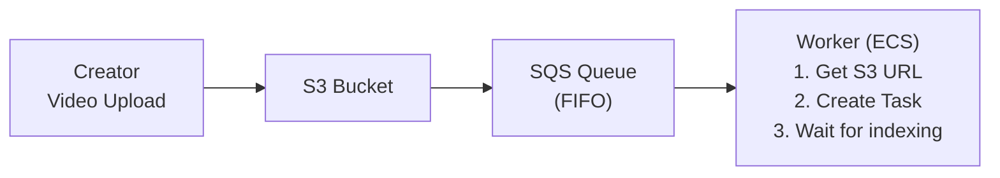
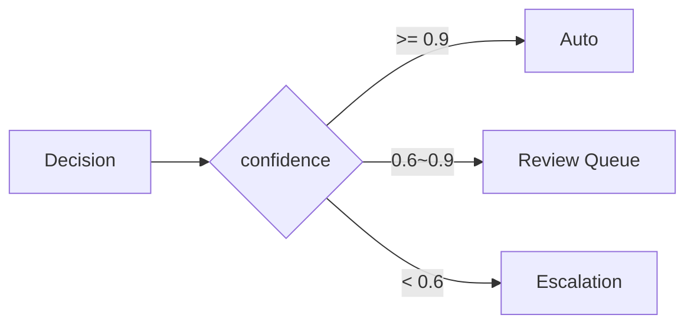
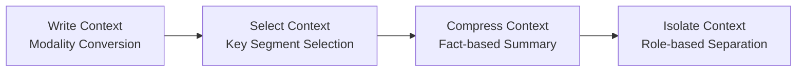
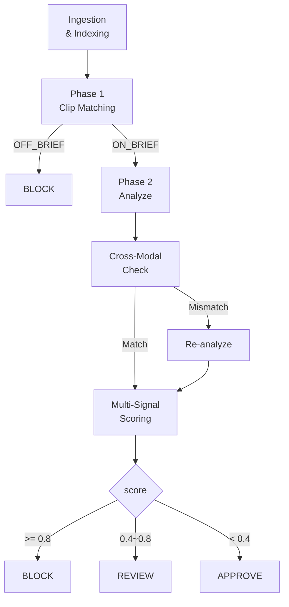
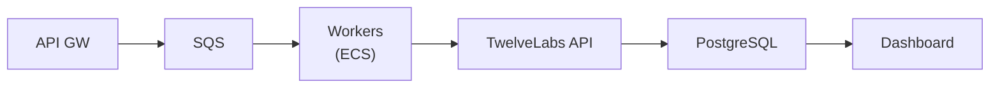
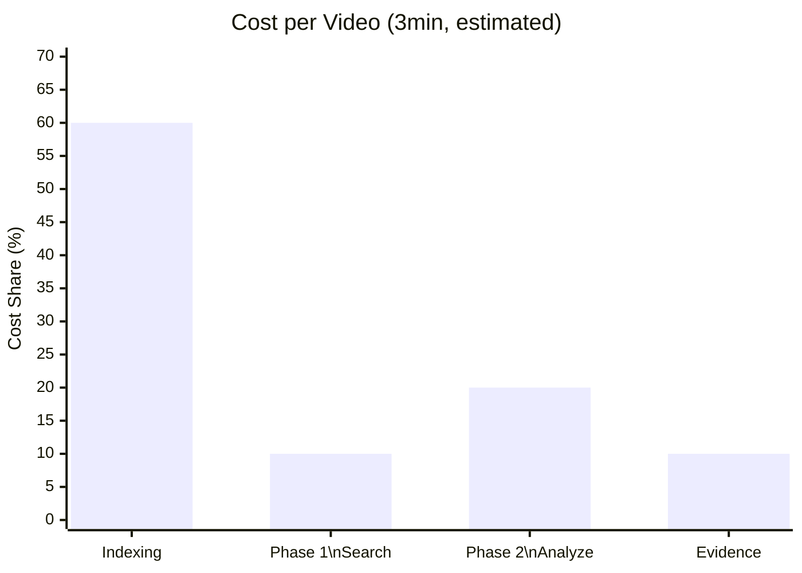
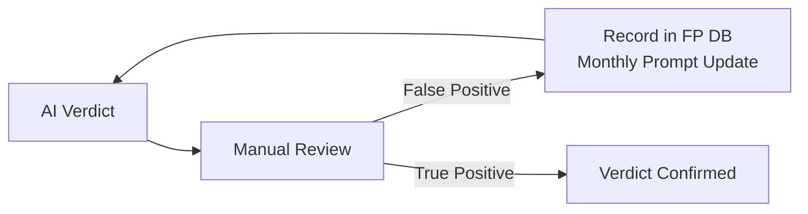

# Ad Compliance Automation Pipeline
# Architecture Design Document (For Developers)

**Author**: Hyunsoo Kim
**Audience**: Developers implementing and maintaining this system  
**Scenario**: Global makeup brand creator video campaign  
**Core Technology**: TwelveLabs Marengo 3.0 / Pegasus 1.2 (SDK v1.3)

---

## Table of Contents

1. [System Overview](#1-system-overview)
2. [Understanding TwelveLabs Models](#2-understanding-twelvelabs-models)
3. [Step 0: Index Creation](#3-step-0-index-creation)
4. [Step 1: Ingestion — Video Collection and Indexing](#4-step-1-ingestion)
5. [Step 2: Phase 1 — Marengo Search (Campaign Relevance)](#5-step-2-phase-1)
6. [Step 3: Phase 2 — Pegasus Analyze (Policy Violation Analysis)](#6-step-3-phase-2)
7. [Step 4: Decision Engine — Verdict Logic](#7-step-4-decision-engine)
8. [Step 5: Evidence Report — Evidence Report Generation](#8-step-5-evidence-report)
9. [Prompt Engineering](#9-prompt-engineering)
10. [Multi-Signal Scoring (Advanced)](#10-multi-signal-scoring)
11. [Infrastructure Architecture](#11-infrastructure-architecture)
12. [Cost Structure and Optimization](#12-cost-structure-and-optimization)
13. [Operations: Thresholds, False Positives, and Feedback Loop](#13-operations)
14. [Future Roadmap](#14-future-roadmap)
15. [References](#15-references)

---

## 1. System Overview

### 1.1 One-Sentence Summary

A pipeline where AI automatically analyzes beauty videos submitted by creators and produces **APPROVE / REVIEW / BLOCK** verdicts with timestamped evidence.

### 1.2 Overall Flow



### 1.3 Why Two Phases

- Phase 1 (Marengo Search): **Low cost, fast**. Checks campaign relevance via search clip matching
- Phase 2 (Pegasus Analyze): **High cost, precise**. Watches the entire video and reasons about policy violations

By blocking irrelevant videos (15–25%) early in Phase 1, we proportionally reduce expensive Phase 2 calls. Off-brief videos are blocked anyway, so policy violation analysis is unnecessary for them.

### 1.4 Requirements Summary

| Item | Target |
|---|---|
| Policy Categories | 6 (Hate, Profanity, Drugs, Unsafe Use, Medical Claims, Campaign Relevance) |
| Verdict | APPROVE / REVIEW / BLOCK + Timestamped Evidence |
| Processing SLA | Under 5 minutes (for videos under 3 minutes) |
| Daily Throughput | 10,000+ |
| False Positive Rate | < 5% |
| Availability | 99.9% |

---

## 2. Understanding TwelveLabs Models

All AI capabilities in this pipeline depend on two TwelveLabs models. Understanding the exact role of each model is a prerequisite for this design document.

### 2.1 Marengo 3.0 — Eyes (Recognition & Search)

| Item | Description |
|---|---|
| Role | Converts video into vector embeddings, semantic search |
| SDK Methods | `client.search.query()` (clip search), `client.indexes.videos.retrieve()` (embeddings) |
| Output | Matched clips with rank, start/end timestamps |
| Pipeline Stage | Phase 1 (Pre-screening) |

> **Note on Search API**: `client.search.query()` in Marengo 3.0 returns `rank` (relative ordering) and clip timestamps. The `score`/`confidence` fields are None in the current SDK. We use clip match count (presence/absence) for campaign relevance determination instead of absolute similarity scores.

**Behavior during indexing:**
- Automatically splits video into 2–10 second segments via **shot boundary detection**
- Beauty tutorials have frequent cuts, resulting in shorter segments → advantageous for precise violation detection
- Each segment is embedded as a 1024-dimensional vector
- Final segments shorter than 2 seconds are automatically trimmed

**Behavior during search:**
- `client.search.query()` finds clips semantically matching the query text
- Returns matched clips with rank and timestamps
- Non-matching videos return 0 clips → clear ON_BRIEF/OFF_BRIEF separation
- Note: Search index propagation may take several seconds after fresh ingestion

### 2.2 Pegasus 1.2 — Brain (Reasoning & Generation)

| Item | Description |
|---|---|
| Role | Watches video and reasons/judges/generates in natural language |
| SDK Methods | `client.analyze()`, `client.analyze_stream()` |
| Output | Natural language text or JSON Schema-enforced output |
| Pipeline Stage | Phase 2 (Deep Analysis), Video summarization, Evidence generation |

**Behavior during analyze calls:**
- **Watches the indexed video from start to finish** (integrating visual + audio + on-screen text)
- Performs reasoning according to prompt instructions
- Specifying `response_format` with a JSON Schema guarantees 100% structured output

### 2.3 Key Differences

```
Marengo (Search):  "Is this video related to beauty?" → score 0.72
Pegasus (Analyze): "At 01:23, lip tint is being applied to the eyes, which constitutes unsafe use" → reasoning
```

- Embedding/search is performed by **Marengo only**. Pegasus does not generate embeddings.
- Generation/reasoning is performed by **Pegasus only**. Marengo does not generate text.
- The reason both models are registered simultaneously during indexing is explained in §3.

---

## 3. Step 0: Index Creation

Everything in the pipeline starts with an index. An index is a container that stores and enables analysis of videos.

### 3.1 Code

```python
from twelvelabs.indexes.types import IndexesCreateRequestModelsItem

index = client.indexes.create(
    index_name="ad-compliance-prod",
    models=[
        IndexesCreateRequestModelsItem(
            model_name="marengo3.0",
            model_options=["visual", "audio"]
        ),
        IndexesCreateRequestModelsItem(
            model_name="pegasus1.2",
            model_options=["visual", "audio"]
        )
    ]
)
```

### 3.2 Why Register Both Models Simultaneously

1. **Models cannot be added after index creation**: A structural constraint of TwelveLabs. To add Pegasus later, you must create a new index and re-index all videos.
2. **Indexing accounts for ~60% of total cost**: Indexing separately per model doubles the cost.
3. **A single indexing enables both models**: Search with Marengo and analyze with Pegasus, without re-indexing.

### 3.3 Modality Options

| Option | Coverage |
|---|---|
| `visual` | Scene, object, action recognition, on-screen text (OCR), brand logos |
| `audio` | Speech transcription (STT), background music, ambient sounds |

In v1.3, the previously granular options (`conversation`, `text_in_video`, `logo`, etc.) were consolidated into just `visual` and `audio`.

### 3.4 Notes

- Index names must be unique → use environment-specific prefixes (e.g., `dev-compliance`, `prod-compliance`)
- Deleting an index also deletes all video data
- Modality settings also cannot be changed after creation → enable both `visual` + `audio` from the start

---

## 4. Step 1: Ingestion — Video Collection and Indexing

### 4.1 Flow



1. Creator uploads video → stored in S3
2. S3 Event Notification → message published to SQS FIFO queue
3. ECS Worker consumes from queue → sends indexing request to TwelveLabs

### 4.2 Indexing API Call

```python
task = client.tasks.create(
    index_id=index.id,
    url=s3_presigned_url  # or file=open(path, "rb")
)

# Async — wait for completion
task.wait_for_done(sleep_interval=5)
# Or set up webhook to receive completion notification
```

### 4.3 What Happens Internally During Indexing

```
[Marengo]
Video → shot boundary detection → split into 2–10s segments
      → each segment embedded as 1024-dimensional vector
      → these vectors become the search targets for search.query()

[Pegasus]
Video → visual+audio representations encoded internally
      → this encoding is used for reasoning when analyze() is called
```

- Indexing duration: 30 seconds to 5 minutes depending on video length
- Calling `search.query()` or `analyze()` before indexing completes will result in an error
- Indexing is performed **only once**. Subsequent search/analyze calls on the same video do not require re-indexing

### 4.4 Why SQS FIFO

- `MessageDeduplicationId` uses video_id → prevents duplicate indexing of the same video
- Order guarantee is not the requirement; deduplication is the key
- DLQ configuration: after 5 consecutive failures, messages move to Dead Letter Queue → automatically routed to manual review queue

---

## 5. Step 2: Phase 1 — Marengo Search (Campaign Relevance)

### 5.1 Purpose

Quickly and cheaply determine: "Is this video related to the beauty campaign?"

### 5.2 API Call

Uses `search.query` to find clips matching the campaign query. Clip match count determines relevance.

```python
result = client.search.query(
    index_id="<index_id>",
    query_text="beauty makeup tutorial product demonstration cosmetics review",
    search_options=["visual"],
    threshold="none",
)

matched = [c for c in result if c.video_id == video_id]
# matched > 0 → ON_BRIEF, matched == 0 → OFF_BRIEF
```

### 5.3 Internal Behavior

1. **Search query**: `client.search.query()` semantically matches the campaign query against all indexed video segments
2. **Filter by video_id**: Results may include clips from multiple videos in the index; filter to the target video
3. **Clip count determination**: Any matched clips → ON_BRIEF; zero clips → OFF_BRIEF

```
Beauty makeup video:  6 clips matched → ON_BRIEF → proceed to Phase 2
Gaming stream video:  0 clips matched → OFF_BRIEF → immediate BLOCK
```

### 5.4 Verdict Criteria

| Matched Clips | Label | Action |
|---|---|---|
| ≥ 1 | `ON_BRIEF` | Proceed to Phase 2 |
| 0 | `OFF_BRIEF` | **Immediate BLOCK** (skip Phase 2) |

### 5.5 Search Index Propagation

After fresh video ingestion, the search index may take several seconds to reflect the new video. The implementation includes a retry mechanism (up to 5 attempts, 3-second intervals) to handle this delay. For already-indexed videos (dedup hit), this is not an issue.

### 5.6 Duplicate Video Detection

Before ingesting, the pipeline checks existing videos by `system_metadata.filename`. If a match is found, the existing `video_id` is reused — avoiding re-indexing cost and search propagation delay.

### 5.7 Examples

- Makeup tutorial → 6 clips match "beauty makeup tutorial..." → ON_BRIEF
- HBO/Chromecast ad → 0 clips match → OFF_BRIEF → BLOCK

---

## 6. Step 3: Phase 2 — Pegasus Analyze (Policy Violation Analysis)

### 6.1 Purpose

Analyze videos that passed Phase 1 for violations across 5 policy categories.

### 6.2 Policy Categories

| # | Category | Code | BLOCK Threshold | REVIEW Threshold |
|---|---|---|---|---|
| 1 | Hate/Harassment | `HATE_HARASSMENT` | 0.65 | 0.40 |
| 2 | Profanity | `PROFANITY` | 0.80 | 0.50 |
| 3 | Drugs/Illegal Activity | `DRUGS_ILLEGAL` | 0.60 | 0.35 |
| 4 | Unsafe Product Use | `UNSAFE_PRODUCT_USE` | 0.70 | 0.45 |
| 5 | Medical/Cosmetic Claims | `MEDICAL_CLAIMS` | 0.75 | 0.45 |

Campaign relevance (the 6th category) was already handled in Phase 1, so only 5 categories are analyzed here.

**Why thresholds differ by category:**
- Hate/Drugs: High brand and legal risk → lower thresholds (more sensitive)
- Profanity: Mild profanity (e.g., "insane") is common in the beauty domain. Higher threshold to prevent false positives
- Medical Claims: Even LOW severity triggers REVIEW (regulatory sensitivity)

### 6.3 API Call

```python
from twelvelabs.types import ResponseFormat

result = client.analyze(
    video_id="<video_id>",
    prompt=COMPLIANCE_PROMPT,  # Detailed in §9
    response_format=ResponseFormat(
        type="json_schema",
        json_schema={
            "type": "object",
            "properties": {
                "overall_status": {
                    "type": "string",
                    "enum": ["APPROVE", "REVIEW", "BLOCK"]
                },
                "summary": {"type": "string"},
                "violations": {
                    "type": "array",
                    "items": {
                        "type": "object",
                        "properties": {
                            "category": {
                                "type": "string",
                                "enum": [
                                    "HATE_HARASSMENT", "PROFANITY",
                                    "DRUGS_ILLEGAL", "UNSAFE_PRODUCT_USE",
                                    "MEDICAL_CLAIMS"
                                ]
                            },
                            "severity": {
                                "type": "string",
                                "enum": ["HIGH", "MEDIUM", "LOW"]
                            },
                            "timestamp_start": {"type": "string"},
                            "timestamp_end": {"type": "string"},
                            "reason": {"type": "string"}
                        },
                        "required": ["category", "severity",
                                     "timestamp_start", "reason"]
                    }
                }
            },
            "required": ["overall_status", "summary", "violations"]
        }
    )
)

data = json.loads(result.data)
```

### 6.4 Internal Behavior

1. Pegasus **watches the indexed video from start to finish** (integrating visual + audio + on-screen text)
2. **Reasons** about violations for each of the 5 categories according to prompt instructions
3. Forces structured output conforming to the JSON Schema

### 6.5 Why Consolidate All 5 Policies into a Single Call

| | Separate Calls (5x) | Consolidated Call (1x) |
|---|---|---|
| Cost | 5x | **1x** |
| Video Watching | Watches 5 times | Watches once |
| Context Sharing | None | **Yes** |
| Implementation Complexity | Must merge 5 results | Simple |

Pegasus re-watches the video from start to finish with every call. Unlike text LLMs, the cost of video analysis is dominated by watching the video itself, not prompt length.

Additionally, a consolidated call shares context across categories. Example: "At 01:23, applying lip tint to the eyes while saying 'blemishes will disappear'" → both `UNSAFE_PRODUCT_USE` and `MEDICAL_CLAIMS` are triggered simultaneously. Separate calls may miss this correlation.

### 6.6 Significance of JSON Schema Enforcement

- When `response_format` is specified, Pegasus **must** output only JSON conforming to the schema
- `enum` constraints prevent the AI from inventing arbitrary categories or severities
- 0% parse failure rate → ensures automation pipeline stability

### 6.7 Example Response

```json
{
  "overall_status": "REVIEW",
  "summary": "A GRWM video where the creator demonstrates foundation and eyeshadow...",
  "violations": [
    {
      "category": "UNSAFE_PRODUCT_USE",
      "severity": "MEDIUM",
      "timestamp_start": "01:23",
      "timestamp_end": "01:31",
      "reason": "Applying lip tint on eyelids as an eyeshadow substitute"
    },
    {
      "category": "MEDICAL_CLAIMS",
      "severity": "LOW",
      "timestamp_start": "02:45",
      "timestamp_end": "02:52",
      "reason": "Audio detected: 'skin blemishes will completely disappear'"
    }
  ]
}
```

---

## 7. Step 4: Decision Engine — Verdict Logic

### 7.1 Input

The Decision Engine receives results from Phase 1 and Phase 2 to produce the final verdict.

```
Input 1: Phase 1 result — campaign_relevance { score, label }
Input 2: Phase 2 result — { overall_status, summary, violations[] }
```

### 7.2 Verdict Matrix

The conditions below are evaluated **top to bottom**; the first matching condition becomes the final verdict.

| Priority | Condition | Verdict |
|---|---|---|
| 1 | Campaign relevance `OFF_BRIEF` (no matched clips) | **BLOCK** |
| 2 | Policy violation severity `HIGH` ≥ 1 | **BLOCK** |
| 3 | Policy violation severity `MEDIUM` ≥ 1 | **REVIEW** |
| 4 | Campaign relevance `BORDERLINE` | **REVIEW** |
| 5 | Medical claims (`MEDICAL_CLAIMS`) severity `LOW` or above | **REVIEW** |
| 6 | None of the above conditions met | **APPROVE** |

**Principle: BLOCK > REVIEW > APPROVE** (the strictest verdict is the final result)

### 7.3 Pseudocode

```python
def decide(phase1_result, phase2_result):
    # 1. Off-brief → BLOCK
    if phase1_result.label == "OFF_BRIEF":
        return "BLOCK", "Off-brief: content unrelated to campaign"

    # 2. HIGH severity → BLOCK
    highs = [v for v in phase2_result.violations if v.severity == "HIGH"]
    if highs:
        return "BLOCK", f"HIGH severity violations detected: {len(highs)}"

    # 3. MEDIUM severity → REVIEW
    mediums = [v for v in phase2_result.violations if v.severity == "MEDIUM"]
    if mediums:
        return "REVIEW", f"MEDIUM severity violations detected: {len(mediums)}"

    # 4. Borderline relevance → REVIEW
    if phase1_result.label == "BORDERLINE":
        return "REVIEW", "Campaign relevance BORDERLINE"

    # 5. Medical claims (any severity) → REVIEW
    medical = [v for v in phase2_result.violations
               if v.category == "MEDICAL_CLAIMS"]
    if medical:
        return "REVIEW", "Medical claims detected (regulatory sensitivity)"

    # 6. All clear
    return "APPROVE", "No violations"
```

### 7.4 Confidence-Based Routing (Human-in-the-loop)

Confidence scores are assigned to Decision Engine verdicts to determine the scope of automated processing.



- Auto-processing only at 0.9+: In ad compliance, false negatives (misses) are more dangerous than false positives (incorrect blocks). Conservative setting.
- In the REVIEW queue, reviewers don't judge from scratch — the AI says "there's an issue at 01:23," and they only need to check that segment → drastically reduces review time
- This strategy enables 70–80% of all videos to be auto-processed, reducing manual review costs by up to 90%

---

## 8. Step 5: Evidence Report — Evidence Report Generation

### 8.1 Report Structure

Every verdict generates a JSON report with the following structure.

```json
{
  "video_id": "vid_abc123",
  "index_id": "idx_def456",
  "submitted_at": "2026-03-24T10:00:00Z",
  "analyzed_at": "2026-03-24T10:02:34Z",
  "processing_time_seconds": 154,

  "decision": "REVIEW",
  "decision_reasoning": "Unsafe product use (MEDIUM) and medical claims (LOW) detected",

  "video_description": "A GRWM video where the creator demonstrates a new foundation and eyeshadow palette...",

  "campaign_relevance": {
    "score": 0.72,
    "label": "ON_BRIEF",
    "detail": { "product_visible": true, "content_type_match": "tutorial" }
  },

  "policy_violations": [
    {
      "category": "UNSAFE_PRODUCT_USE",
      "severity": "MEDIUM",
      "timestamp_start": "01:23",
      "timestamp_end": "01:31",
      "reason": "Applying lip tint on eyelids as an eyeshadow substitute",
      "confidence": 0.81
    }
  ],

  "violation_summary": { "total": 2, "high": 0, "medium": 1, "low": 1 }
}
```

### 8.2 Video Summary Generation

A separate `analyze()` call generates a 2–5 sentence fact-based summary.

```python
result = client.analyze(
    video_id="<video_id>",
    prompt="Summarize this video in 2-5 sentences. "
           "Include featured products, demonstrations, mood, and setting."
)
```

This summary is used by manual reviewers to understand context without watching the video.

---

## 9. Prompt Engineering

### 9.1 Prompt Structure

```xml
<system_instruction>
  Role definition, judgment criteria, output format specification
</system_instruction>

<policy_definitions>
  Violation criteria + acceptable ranges per category
</policy_definitions>

<campaign_context>
  Brand name, product line, expected content types
</campaign_context>

<negative_examples>
  List of acceptable expressions to prevent false positives
</negative_examples>

<task>
  Specific analysis instructions
</task>
```

### 9.2 Core Principles

1. **Enum constraints**: JSON Schema `enum` restricts categories and severities. Prevents the AI from generating arbitrary values
2. **Negative prompting**: "Do not classify colloquial expressions like 'this color is killer' in makeup tutorials as hate speech"
3. **Severity guidelines**: Explicitly state HIGH/MEDIUM/LOW judgment criteria per category in the prompt
4. **XML tag separation**: Separate instructions, policies, and context with tags so the model doesn't confuse roles

### 9.3 Video Context Engineering (TwelveLabs Framework)



| Pillar | Application |
|---|---|
| Write | Speech transcription + key action descriptions → foundational data for AI reasoning |
| Select | Use Search API to select only high-violation-probability segments → pass to Pegasus |
| Compress | Summarize a 10-minute video into key facts → maximize token efficiency |
| Isolate | Separate [instructions], [policies], [video facts] with XML tags within the prompt |

---

## 10. Multi-Signal Scoring (Advanced)

### 10.1 Limitations of the Basic Structure

The basic pipeline relies on only two signals: Marengo score + Pegasus severity.

| Problem | Description |
|---|---|
| Single model dependency | No correction mechanism if the model is wrong |
| Uncalibrated confidence scores | confidence 0.7 ≠ actual 70% accuracy |
| Cross-modal contradiction undetected | Contradictions between visual and audio go undetected |

### 10.2 Five Advanced Techniques

#### ① Ensemble Scoring (Apply Immediately)

```
final_score = α × S_embed + β × S_analyze + γ × S_embedding

S_embed    = Marengo Embed cosine similarity (0–1, from §5.2 approach)
S_analyze  = Pegasus severity numerized (HIGH=1.0, MEDIUM=0.6, LOW=0.3)
S_embedding = cosine similarity between campaign brief vector and video vector

Initial values: α=0.3, β=0.5, γ=0.2 → optimize via logistic regression after accumulating operational data
```

#### ② Platt Scaling Calibration (Apply After 2 Weeks)

```
P(violation | score) = 1 / (1 + exp(-(a × score + b)))

Training data: (model output, manual review result) pairs from first 2 weeks of operation
Effect: raw score 0.7 → calibrated 0.82 (actual violation probability)
```

Threshold setting becomes based on statistical evidence rather than intuition.

#### ③ Cross-Modal Consistency Verification (Apply Immediately)

```
visual_emb = Marengo Embed (visual only)
audio_emb  = Marengo Embed (audio only)

consistency = cosine_similarity(visual_emb, audio_emb)
consistency < 0.4 → inconsistency warning → re-analyze that segment with Pegasus
```

Example: Visual shows "lipstick application," audio mentions "eyeliner" → inconsistency flag

**Note**: Embeddings are generated by Marengo only. Pegasus is used only for re-analysis (reasoning).

#### ④ Embedding-Based Anomaly Detection (After 1 Month)

```
Mahalanobis distance:
D(x) = √((x - μ)ᵀ Σ⁻¹ (x - μ))

x = new video segment embedding, μ = normal video mean, Σ = covariance matrix
D > threshold → flag anomalous segment
```

Catches "things that differ from normal" without needing to define what constitutes a violation. Apply after accumulating 100+ approved normal videos.

#### ⑤ Bayesian Update (After 2 Months)

```
P(violation|current_video) ∝ P(current_video|violation) × P(violation|creator_history)

Creator A: 2 violations out of 50 past videos → prior=0.04
Creator B: 15 violations out of 50 past videos → prior=0.30
Same score 0.5 → A is adjusted to 0.35, B is adjusted to 0.68
```

### 10.3 Application Priority

| Technique | Difficulty | Impact | Required Data | Timing |
|---|---|---|---|---|
| ① Ensemble | Low | Medium | None | **Immediately** |
| ③ Cross-modal | Medium | High | None | **Immediately** |
| ② Calibration | Low | High | 2 weeks of manual reviews | **After 2 weeks** |
| ④ Anomaly Detection | Medium | High | 100+ approved videos | After 1 month |
| ⑤ Bayesian | Medium | Medium | Creator history | After 2 months |

### 10.4 Overall Flow After Advanced Techniques Applied



---

## 11. Infrastructure Architecture

### 11.1 Overall Configuration



- **ECS Fargate**: Auto-scales workers based on SQS queue depth
- **SQS FIFO**: Deduplication + DLQ
- **PostgreSQL**: Stores analysis results and verdict history
- **S3**: Stores original videos and thumbnails

### 11.2 Rate Limit Handling

```
Worker-level semaphore (concurrent request limit)
  → Exponential backoff on 429 response (2s → 4s → 8s → 16s + jitter)
  → Monitor X-RateLimit-Remaining header
  → Move to DLQ after 5 consecutive failures
```

### 11.3 Error Handling Pattern

```python
try:
    result = client.analyze(video_id=vid, prompt=prompt,
                            response_format=fmt)
    data = json.loads(result.data)
except twelvelabs.core.ApiError as e:
    if e.status_code == 429:
        retry_with_backoff()       # Rate limit
    elif e.status_code == 404:
        check_indexing_status()    # Indexing not complete
    else:
        send_to_dlq(video_id, error=str(e))
except json.JSONDecodeError:
    retry_once()                   # Extremely rare
```

---

## 12. Cost Structure and Optimization

### 12.1 Cost Breakdown



Indexing accounts for ~60%, the largest share. Once indexed, videos can be reused for multiple analyses.

### 12.2 Optimization Strategies

| Strategy | Savings | Description |
|---|---|---|
| Index once → analyze N times | ~60% reprocessing prevention | Reuse existing index on resubmission |
| All policies in a single analyze call | 5x savings | 5 categories in 1 call |
| Phase 1 Pre-screening | 15–25% Pegasus savings | Early blocking of off-brief content |
| Streaming (`analyze_stream()`) | Perceived speed improvement | Reduced TTFB |
| Via Amazon Bedrock | Future caching potential | Infrastructure-level caching opportunity |

### 12.3 Cost Comparison by Model (Per 1-Minute Video)

| Model | Cost/min | Structured Output | Recommended Use |
|---|---|---|---|
| TwelveLabs Pegasus 1.2 | ~$2.79 | JSON Schema enforced | Policy analysis (recommended) |
| Google Gemini | ~$10.62 | Unstable | Auxiliary verification |
| AWS Nova | ~$0.22 | Weak | Low-cost simple classification |

### 12.4 Monthly Operating Cost Estimate (1,000 videos/day)

| Item | Monthly Cost |
|---|---|
| TwelveLabs API | Varies per TwelveLabs pricing policy |
| AWS Infrastructure (ECS, SQS, S3, RDS) | $500–1,500 |
| Manual Review Staff | 70–90% reduction vs. baseline |

---

## 13. Operations: Thresholds, False Positives, and Feedback Loop

### 13.1 Initial 2-Week Calibration

```
Week 1–2: Treat all verdicts as REVIEW
  → Manual reviewers verify AI verdict accuracy
  → Collect (AI verdict, actual result) pairs
  → Calibrate thresholds via Platt Scaling

Week 3+: Begin automated processing with calibrated thresholds
```

### 13.2 Beauty Domain False Positive Management

| Expression | AI False Positive | Actual Meaning |
|---|---|---|
| "This color is killer" | HATE_HARASSMENT | Positive colloquial expression |
| "This is insane" | PROFANITY | Exclamation of admiration |
| "My skin came back from the dead" | HATE_HARASSMENT | Efficacy expression |
| Tapping face with brush | UNSAFE_PRODUCT_USE | Makeup demonstration |

**Mitigation**: Negative prompting + false positive DB accumulation + monthly prompt updates

### 13.3 Feedback Loop



---